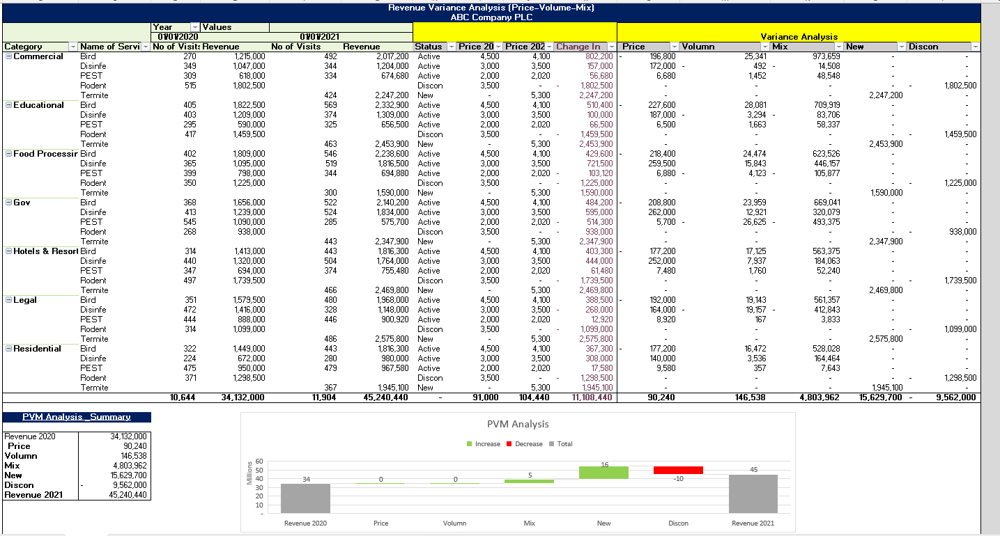
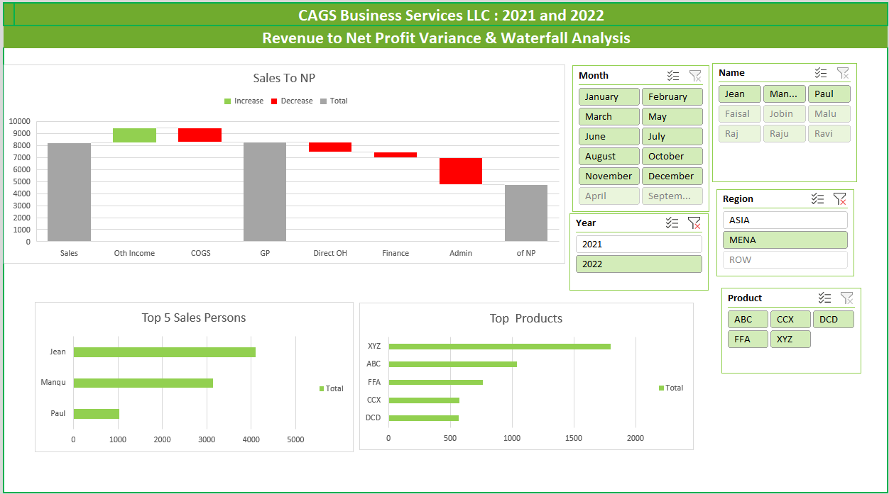

# FP&A Projects Portfolio

This repository showcases my FP&A and financial analysis models developed in Microsoft Excel.
---

## 📊 Projects Included

### 1. Revenue Variance Analysis – PVM Model
* Price–Volume–Mix (PVM) analysis to understand key revenue drivers
* Identifies impact of pricing, sales volume, and product mix on revenue performance

---

### 2. Revenue to Net Profit Waterfall Model
* Visual bridge from Revenue to Net Profit
* Highlights key cost drivers and profitability movements

---

## 🛠 Tools Used

* Microsoft Excel (Advanced formulas, Power Query)
* Power BI (for dashboards)
---

## 🎯 Purpose

To demonstrate practical FP&A capabilities in:

* Financial modeling
* Variance analysis
* Profitability analysis
* Decision support

---

## 💡 Key Insight

These models are designed to support management decision-making by clearly visualizing financial performance drivers and identifying areas for improvement.

